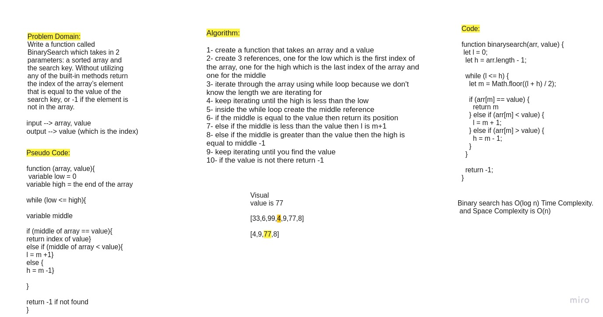

# Binary Search of Sorted Array
Write a function called BinarySearch which takes in 2 parameters: a sorted array and the search key. Without utilizing any of the built-in methods available to your language, return the index of the array’s element that is equal to the value of the search key, or -1 if the element is not in the array.
NOTE: The search algorithm used in your function should be a binary search.
Check the Resources section for details

## Whiteboard Process

## Approach & Efficiency
Time Complexity. O(log n)
Space Complexity is O(n) because each step of the algorithm halves the number of elements. It’s done when there’s only one element left. So if the number of steps is k, then n ~ 2**k, so k ~ log2(n).