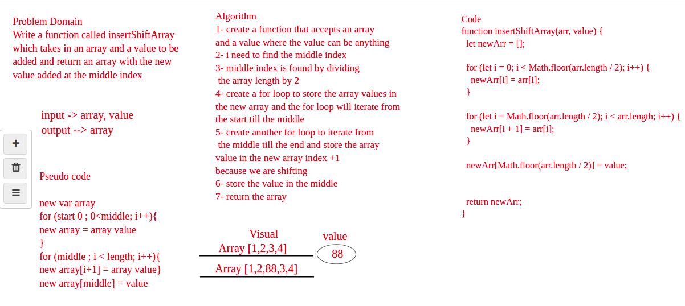

# Insert to Middle of an Array

## Discription of the challenge
Write a function called insertShiftArray which takes in an array and a value to be added. Without utilizing any of the built-in methods available to your language, return an array with the new value added at the middle index.

## Whiteboard Process

## Approach & Efficiency
the approach i took is checking the index using if statement