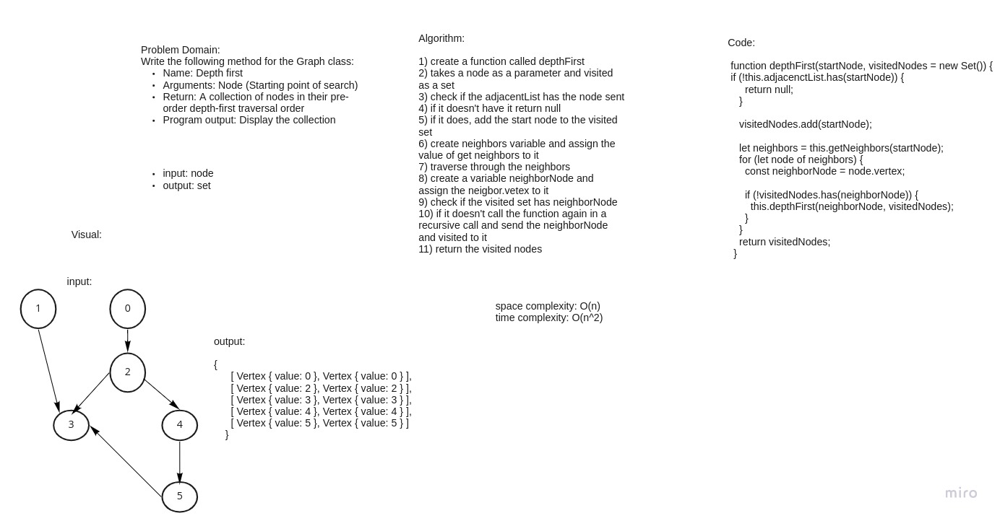

# Challenge Summary
Write the following method for the Graph class:
breadth first
Arguments: Node
Return: A collection of nodes in the order they were visited.
Display the collection

## Whiteboard Process

## Approach & Efficiency
The time complexity is O(n^2) because the code iterates through all the nodes and has a recursive call
and could grow to the size of all vertices in the worst-case scenario. As a result, the complexity of time is O(n^2) and space is O(n) because we created a collection Set to store the visited nodes

## Solution
npm test graph