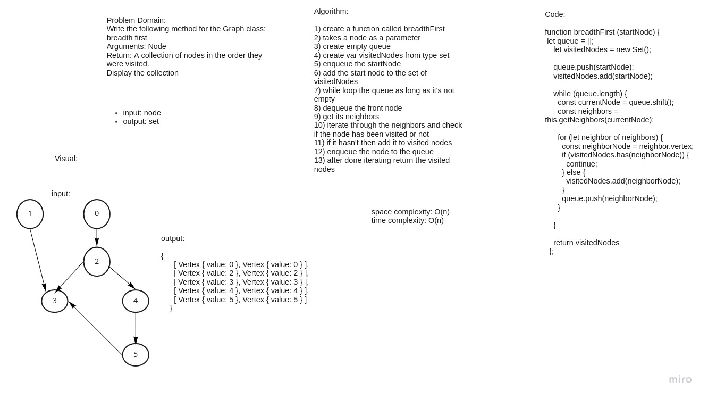

# Challenge Summary
Write the following method for the Graph class:
breadth first
Arguments: Node
Return: A collection of nodes in the order they were visited.
Display the collection

## Whiteboard Process

## Approach & Efficiency
space and time complexity is O(n) because we are visiting all the nodes and created a new collection using set, so used extra memory.

## Solution
npm test graph
