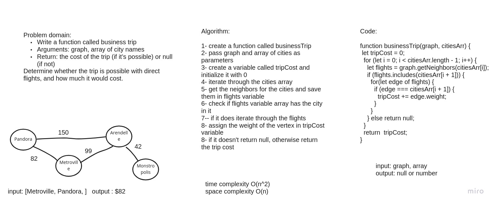

# Challenge Summary
Given a business trip itinerary, and an Alaska Airlines route map, is the trip possible with direct flights? If so, how much will the total trip cost be?

## Whiteboard Process

## Approach & Efficiency
The time complexity is O(n^2) because the code iterates through all the nodes with 2 for loops and space is O(n) because we used extra memory

## Solution
npm test graph
