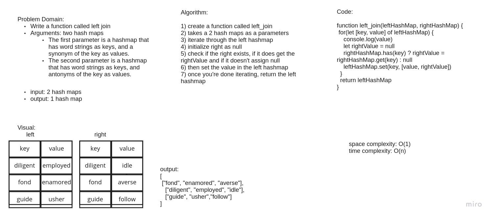

# Challenge Summary
Write a function called repeated word that finds the first word to occur more than once in a string
Arguments: string
Return: string

## Whiteboard Process

this is the whiteboard.

## Approach & Efficiency
Time: O(n)
because we are looping through the hashMap
Space: O(1) because it doesn't need extra space and it excutes in place.

## Solution
npm test hashtable