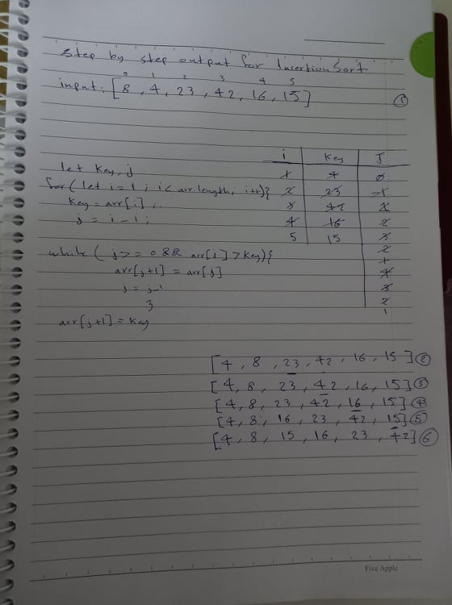

Insertion Sort:
Insertion sort is a simple sorting algorithm that works similar to the way you sort playing cards in your hands. The array is virtually split into a sorted and an unsorted part. Values from the unsorted part are picked and placed at the correct position in the sorted part.

Tracing: 

while 0>= 0 and 8 > 4 evaluates to true, it will enter and shift the elements 

while 1>=0 && 8 > 23 evaluates to false, so there's no need to shift and arr[2] will stay the same.

while 2>= 0 && 23 > 42 evaluates to false so there's no need to shift arr[3] and it will stay the same.

while 3>= 0 && 42 > 16 evaluates to true, index 4 will be 42.
while 2>=0 && 23 > 16 evaluates to true, index 3 will be 23
while 1>=0 && 8 > 16 evaluates to false, so it will not enter and it will exit the while loop. it will go staright to arr[j+1] = key which is 16 

while 4>=0 && 42 > 15 evaluates to true, index 5 will be 42
while 3>=0 && 23> 15 evaluates to true, index 4 will be 23
while 2>= 0 && 16 > 15 evaluates to true, so index 3 will be 16
while 1>=0 && 8 > 15 evaluates to false so it will go to arr[j+1] = key so index 2 will be 15

Efficency
Time: O(n) in the best case in case it's sorted
in the average and worst case it's O(n^2) because we are using nested loop and because we need to shift the elements 
Space: O(1)
No additional space is being created. This array is being sorted in place…keeping the space at constant O(1).
