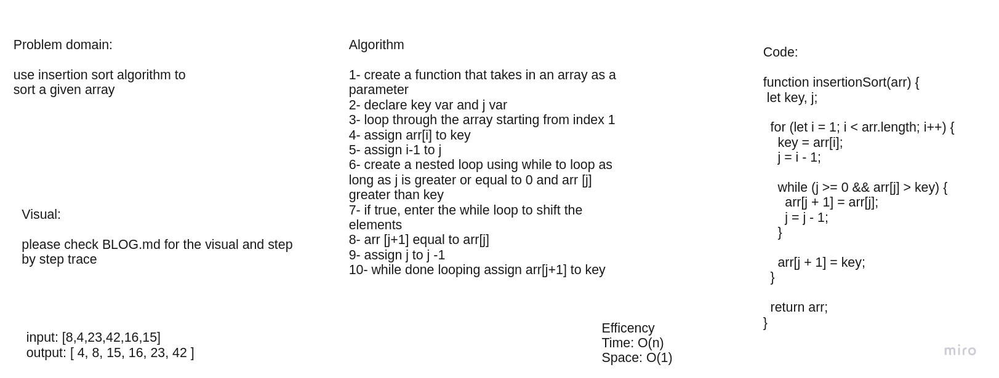

# Challenge Summary
trace the insertion sort algo by stepping through the process with the provided sample array. Document your explanation by creating a blog article that shows the step-by-step output after each iteration through some sort of visual.

Once you are done with your article, code a working, tested implementation of Insertion Sort based on the pseudocode provided.

## Whiteboard Process

[Go to BLOG.md for the visual and tracing](./BLOG.md)

## Approach & Efficiency
Time: O(n) in the best case in case it's sorted
in the average and worst case it's O(n^2) because we are using nested loop and because we need to shift the elements 
Space: O(1)
No additional space is being created. This array is being sorted in place…keeping the space at constant O(1).

## Solution
npm test is  

[Go to BLOG.md](./BLOG.md)
