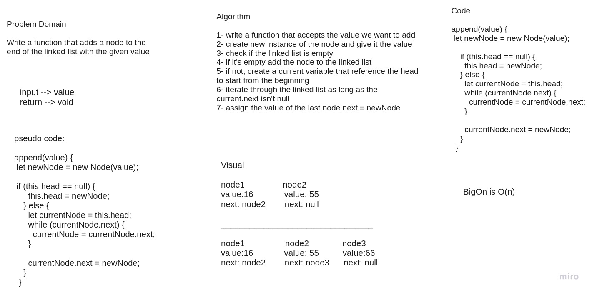
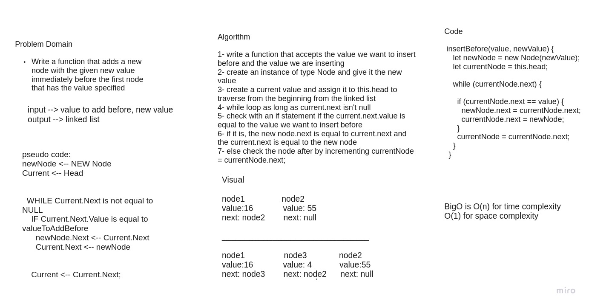
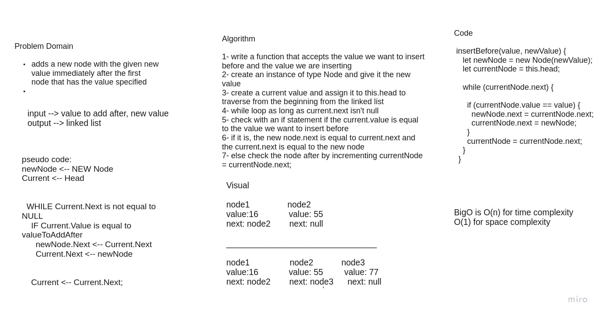

# Challenge Summary
Extending an Implementation for linked list where we write insertion methods

## Whiteboard Process

## Approach & Efficiency
Append: takes big O(n) for time compelxity because we are traversing through all nodes in linkedlist to find the last one and space O(1) 
insertBefore: takes big O(n) for time compelxity because we are traversing through all nodes in linkedlist until we find what we are looking for and worst case is traversing through all nodes and space O(1)
 
insertAfter: takes big O(n) for time compelxity because we are traversing through all nodes in linkedlist until we find what we are looking for and worst case is traversing through all nodes and space O(1)

## Solution
npm test to run the code.
