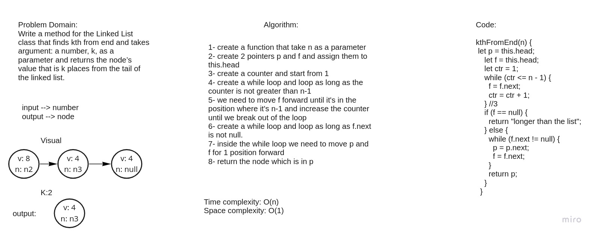

# Challenge Summary
Write a method for the Linked List class that finds kth from end and takes argument: a number, k, as a parameter and returns the node’s value that is k places from the tail of the linked list.

## Whiteboard Process

## Approach & Efficiency
Big O space is O(1) because based on that the memory consumption of my algorithm remains constant because I just modify the existing nodes without creating any new nodes
and Big O fir time complexity is O(n) because at the wors case we will have to traverse through the entire linked list

## Solution
npm test