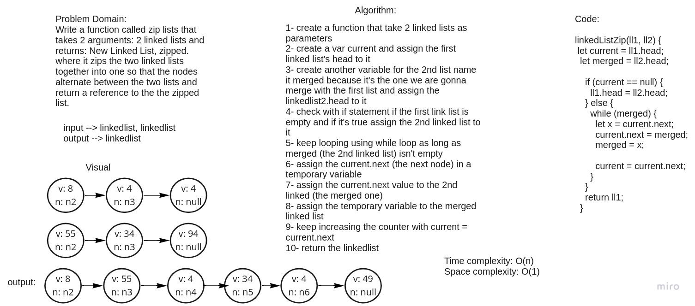

# Challenge Summary
Write a function called zip lists that takes 2 arguments: 2 linked lists and returns: New Linked List, zipped. where it zips the two linked lists together into one so that the nodes alternate between the two lists and return a reference to the the zipped list.

## Whiteboard Process

## Approach & Efficiency
<!-- What approach did you take? Why? What is the Big O space/time for this approach? -->

## Solution
npm test to run the code