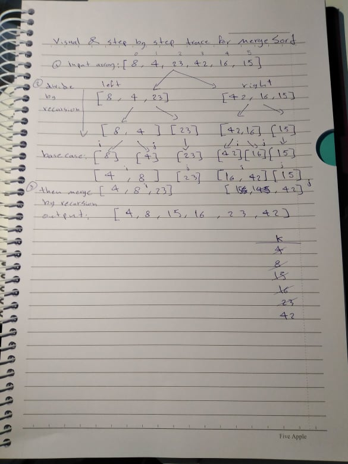

Merge Sort:
Merge Sort is a Divide and Conquer algorithm. It divides the input array into two halves, calls itself for the two halves, and then it merges the two sorted halves

Tracing:  

Efficency
Time: O(n*Log n):
The time complexity of MergeSort is O(n*Log n) in all the 3 cases 
(worst, average and best). As the mergesort always divides the array into two halves 
and takes linear time to merge two halves.

Space: O(n)
Space complexity is O(n) as you have to store the elements somewhere. Additional space complexity can be O(n) in an implementation using arrays. The total space usage required will always be bounded by O(3n) = O(n).
