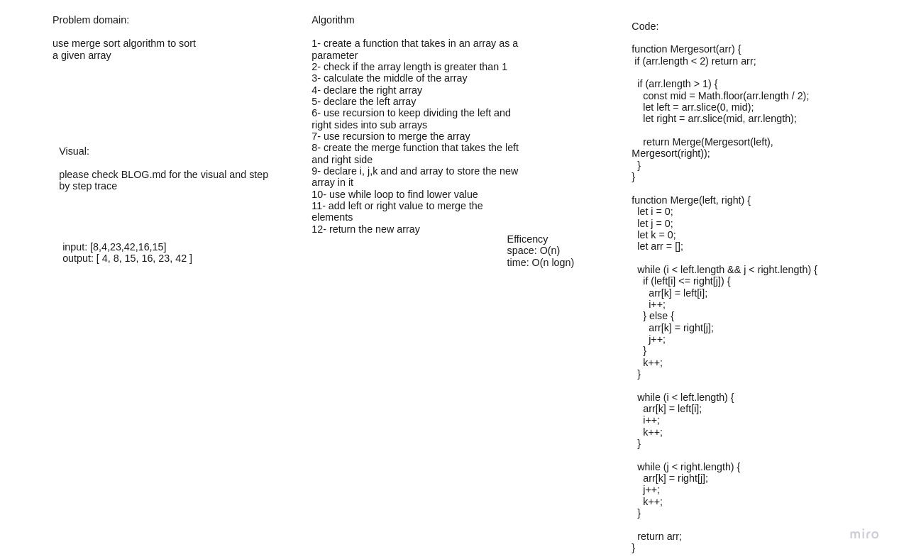

# Challenge Summary
trace the algorithm by stepping through the process with the provided sample array. Document your explanation by creating a blog article that shows the step-by-step output after each iteration through some sort of visual.

Once you are done with your article, code a working, tested implementation of Merge Sort.

## Whiteboard Process

[Go to BLOG.md for the visual and tracing](./BLOG.md)

## Approach & Efficiency
Time: O(n*Log n):
The time complexity of MergeSort is O(n*Log n) in all the 3 cases 
(worst, average and best). As the mergesort always divides the array into two halves 
and takes linear time to merge two halves.

Space: O(n)
Space complexity is O(n) as you have to store the elements somewhere. Additional space complexity can be O(n) in an implementation using arrays. The total space usage required will always be bounded by O(3n) = O(n).

## Solution
npm test merge  

[Go to BLOG.md](./BLOG.md)
