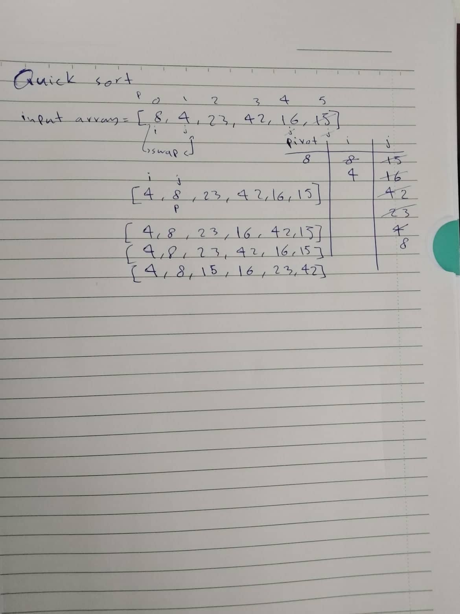

Quick Sort:
Quick Sort algorithm follows Divide and Conquer approach. It divides elements into smaller parts based on some condition and performing the sort operations on those divided smaller parts.

Tracing:  

Efficency
Time: O(n*Log n):
The time complexity of quicksort is O(n*Log n) in all the 3 cases 
(worst, average and best). As the quicksort always divides the array into two halves and perform partition operation

Space: O(1)
Space complexity is O(1) as you are not using extra space. The total space usage required will always be bounded by 1 because no extra space is used
