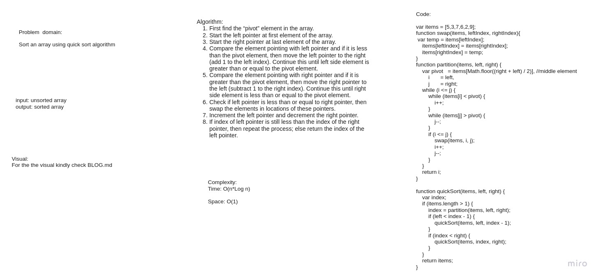

# Challenge Summary
trace the algorithm by stepping through the process with the provided sample array. Document your explanation by creating a blog article that shows the step-by-step output after each iteration through some sort of visual.

Once you are done with your article, code a working, tested implementation of Quick Sort based on the pseudocode provided.

## Whiteboard Process

[Go to BLOG.md for the visual and tracing](./BLOG.md)

## Approach & Efficiency
Time: O(n*Log n)
because it divides the array into 2 halves 

Space: O(1) because it doesn't need extra space and it excutes in place.

## Solution
npm test quick  

[Go to BLOG.md](./BLOG.md)
