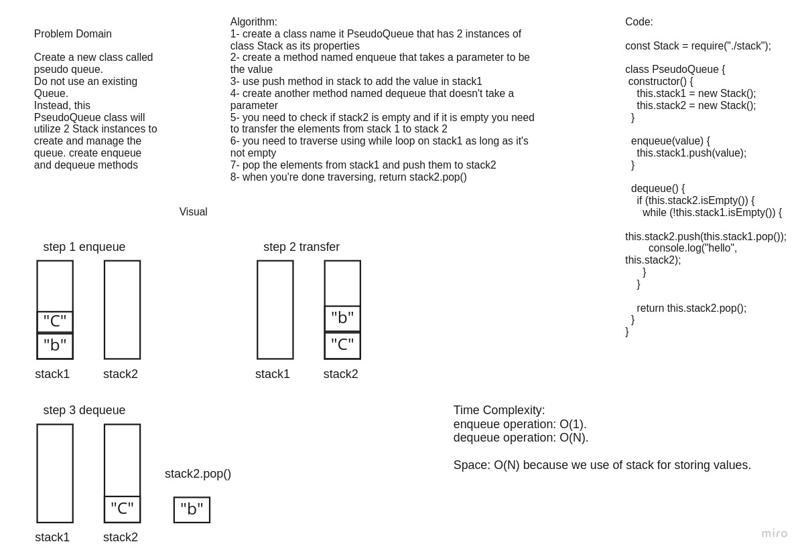

# Challenge Summary
Create a new class called pseudo queue.
Do not use an existing Queue.
Instead, this PseudoQueue class will implement our standard queue interface (the two methods listed below),
Internally, utilize 2 Stack instances to create and manage the queue

## Whiteboard Process

## Approach & Efficiency
Time Complexity: 
enqueue operation: O(1): because it's same as pop operation in stack.
dequeue operation: O(N): because in the worst case we have empty whole of stack 1 into stack 2
Space: O(N) because we use of stack for storing values.

## Solution
npm test stackAndQueue