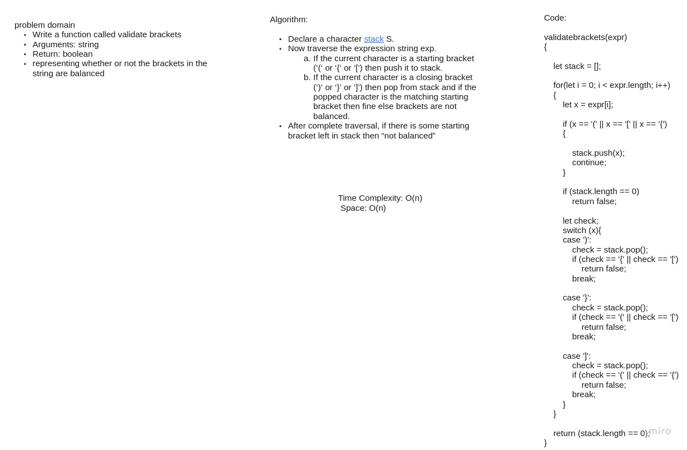

# Challenge Summary
Write a function called validate brackets
Arguments: string
Return: boolean
representing whether or not the brackets in the string are balanced

## Whiteboard Process

## Approach & Efficiency
Time Complexity: O(n) 
 Space: O(n)

## Solution
npm test