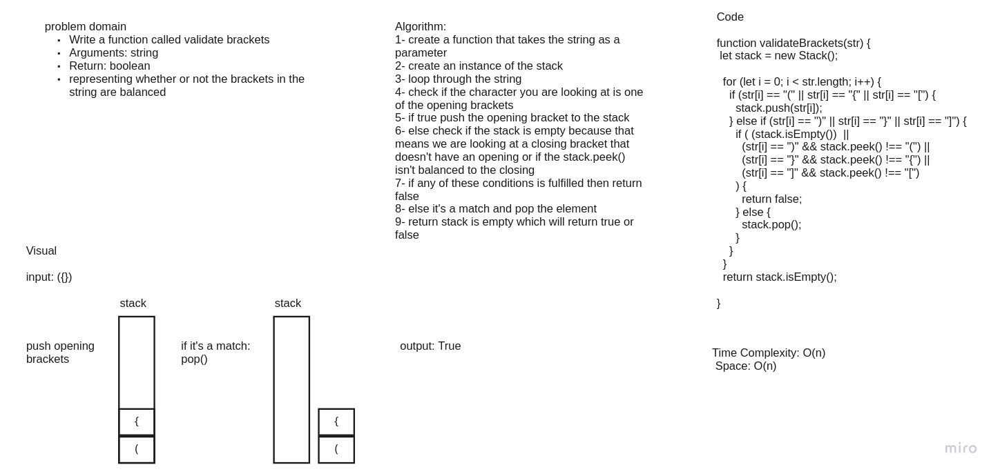

# Challenge Summary
Write a function called validate brackets that takes string as arguments
and returns boolean representing whether or not the brackets in the string are balanced

## Whiteboard Process

## Approach & Efficiency
Time Complexity: O(n) because n is the number of characters in the string and the program is running in linear time. the Space is: O(n) because in the worst case it will be many opening branckets like this ((())) which scales in a linear time and it's iterative.

## Solution
npm test stackAndQueue