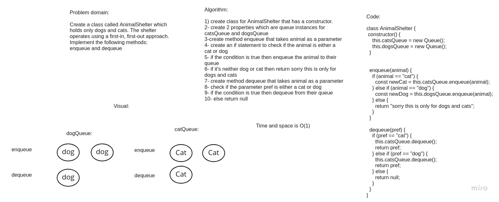

# Challenge Summary
create a class called AnimalShelter which holds only dogs and cats. The shelter operates using a first-in, first-out approach.

## Whiteboard Process

## Approach & Efficiency
time complexity for enqueue() and dequeue()	 is O(1)  it is clear that each instruction takes constant time to execute. So, its time complexity will always be constant for best, average and worst cases. and Space Complexity : O(1)

## Solution
npm test animalShelter to run the code 