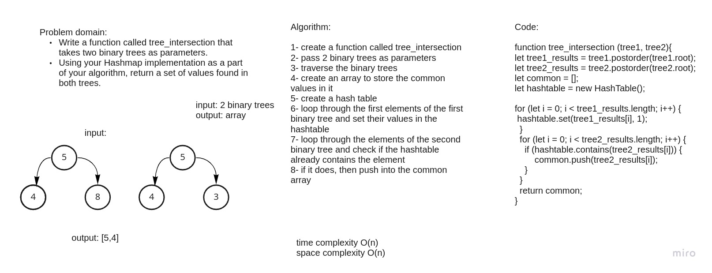

# Challenge Summary
Write a function called tree_intersection that takes two binary trees as parameters.
Using your Hashmap implementation as a part of your algorithm, return a set of values found in both trees.

## Whiteboard Process

## Approach & Efficiency
Time: O(n)
because we are looping through an array and looping through the 2 trees
Space: O(n) because a new space was used

## Solution
npm test intersection