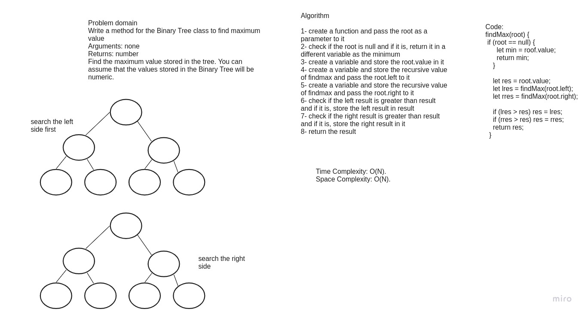

# Challenge Summary
Write a method for the Binary Tree class to find maximum value
Arguments: none
Returns: number
Find the maximum value stored in the tree. You can assume that the values stored in the Binary Tree will be numeric.

## Whiteboard Process

## Approach & Efficiency
Time Complexity: O(N). in the recursive function calls, every node of the tree is checked once and because of this the complexity is O(N) 
Space Complexity: O(N). because of the recursive call 

## Solution
npm run tree