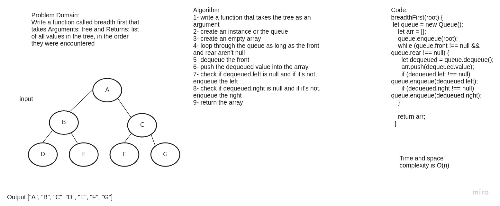

# Challenge Summary
Write a function called breadth first that takes Arguments: tree and Returns: list of all values in the tree, in the order they were encountered

## Whiteboard Process

## Approach & Efficiency
n is the total amount of nodes in the binary tree Time: O( n )
Space: With output: O( n ) because we will store n nodes in the list of levels structure.
Without output: O( n ) the queue at maximum at any point in time will hold some fractional component of the total nodes in the tree.

## Solution
npm test tree