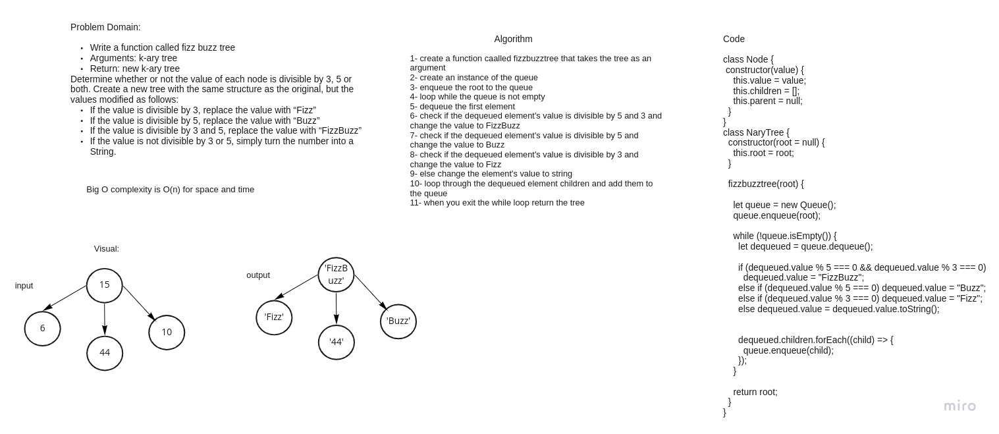

# Challenge Summary
Write a function called fizz buzz tree
Arguments: k-ary tree
Return: new k-ary tree
Determine whether or not the value of each node is divisible by 3, 5 or both. Create a new tree with the same structure as the original, but the values modified as follows:

If the value is divisible by 3, replace the value with “Fizz”
If the value is divisible by 5, replace the value with “Buzz”
If the value is divisible by 3 and 5, replace the value with “FizzBuzz”
If the value is not divisible by 3 or 5, simply turn the number into a String.

## Whiteboard Process

## Approach & Efficiency
The Big O time complexity is O(n). Searching for node will also be O(n). Because of the lack of organizational structure. The worst case for most operations will involve traversing the entire tree. 
The Big O space complexity will be O(w) because I'm implementing breadth first using a queue, where w is the largest width of the tree.

## Solution
npm test nary